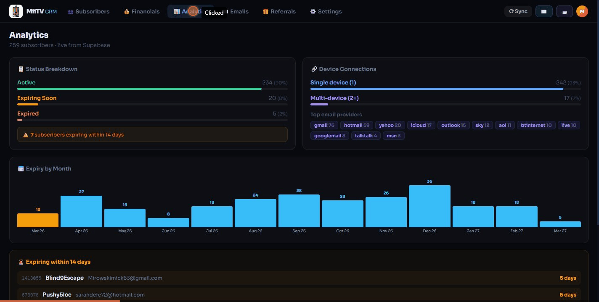

# MiiTV CRM

A full-featured Customer Relationship Management system built for MiiTV — a UK-based IPTV subscription service. Manage subscribers, track renewals, send emails, handle referrals and view financial analytics all in one dark-themed dashboard.

🌐 **Live:** [miitv-crm.vercel.app](https://miitv-crm.vercel.app)  
📱 **Available as Android APK** via Capacitor

---

## Demo



---

## Features

### 👥 Subscribers
- Full subscriber list with search, filter by status & connections, sortable columns
- Click any subscriber to open a detail panel with email, expiry, referral info and quick actions
- Clickable stat cards to instantly filter by Active / Expiring / Expired / Multi-device
- UK date format (DD/MM/YYYY) throughout

### 📊 Analytics
- Live status breakdown (Active / Expiring Soon / Expired) with percentages
- Device connection stats (single vs multi-device)
- Top email providers chart
- Expiry-by-month bar chart (clickable to filter subscribers)
- 🚨 Urgent expiry list — subscribers expiring within 14 days

### 💰 Financials
- Log revenue and costs with categories
- Net profit calculation and monthly summaries
- Edit and delete entries

### ✉️ Emails
- **3 send modes:** Individual, Group/Bulk, or Pick Users
- **Email templates** — full CRUD editor with `[Name]`, `[date]` and `[days]` placeholders
- Open tracking pixel — see when emails are opened, how many times, and when last opened
- Full sent email history with read receipts and resend option
- Send directly from any template in Settings

### 🎁 Referrals
- Log who referred who with full referrer/referred tracking
- Reward milestones: 1 referral = 1 month free, 6 referrals = 12 months free TV
- Top referrers leaderboard with progress to milestone
- Link referred customers directly from subscriber detail panel

### ⚙️ Settings
- **Company Profile** — logo upload, name, tagline, contact details, email signature
- **Email Templates** — create, edit, delete with live preview and send directly
- **Google Sheet Sync** — pull latest subscribers from Google Sheets into the database
- **Change Password** — update your password from within the CRM
- **Team Invites** — invite colleagues via magic link
- **Sign Out** — available from topbar avatar dropdown

### 🔒 Authentication
- Password login and magic link (passwordless)
- Forgot password / reset password
- Supabase Auth with session persistence

### 📱 Android App
- Packaged as a native Android APK via Capacitor
- Signed release builds
- Custom MiiTV app icon
- Mobile-responsive layout with bottom navigation

---

## Tech Stack

| Layer | Technology |
|---|---|
| Frontend | Next.js 16 + React |
| Database | Supabase (PostgreSQL) |
| Auth | Supabase Auth |
| Email | EmailJS |
| Deployment | Vercel |
| Mobile | Capacitor (Android) |

---

## Setup

### 1. Clone & install

```bash
git clone https://github.com/YOUR_USERNAME/miitv-crm.git
cd miitv-crm
npm install
```

### 2. Configure environment

```bash
cp .env.local.example .env.local
```

Fill in your credentials in `.env.local` — see `.env.local.example` for all required variables.

### 3. Run locally

```bash
npm run dev
```

Open [http://localhost:3000](http://localhost:3000)

---

## Environment Variables

| Variable | Description |
|---|---|
| `NEXT_PUBLIC_SUPABASE_URL` | Your Supabase project URL |
| `NEXT_PUBLIC_SUPABASE_ANON_KEY` | Supabase publishable anon key |
| `SUPABASE_SERVICE_ROLE_KEY` | Supabase service role key (server only) |
| `NEXT_PUBLIC_GOOGLE_SHEET_ID` | Google Sheet ID for subscriber sync |
| `NEXT_PUBLIC_EMAILJS_SERVICE_ID` | EmailJS service ID |
| `NEXT_PUBLIC_EMAILJS_TEMPLATE_ID` | EmailJS template ID |
| `NEXT_PUBLIC_EMAILJS_PUBLIC_KEY` | EmailJS public key |
| `NEXT_PUBLIC_APP_URL` | Your deployed app URL |

---

## Deployment

### Web (Vercel)

```bash
npx vercel --prod
```

Set all environment variables in Vercel dashboard under **Settings → Environment Variables**.

### Android APK

```bash
npm run build
npx cap sync android
cd android
.\gradlew assembleRelease \
  "-Pandroid.injected.signing.store.file=path/to/keystore" \
  "-Pandroid.injected.signing.store.password=YOUR_PASS" \
  "-Pandroid.injected.signing.key.alias=YOUR_ALIAS" \
  "-Pandroid.injected.signing.key.password=YOUR_PASS"
```

---

## Database Tables

| Table | Purpose |
|---|---|
| `subscribers` | Subscriber records synced from Google Sheets |
| `revenue` | Revenue entries |
| `costs` | Cost/expense entries |
| `activity` | Notes and email activity log per subscriber |
| `email_tracking` | Open tracking for sent emails |
| `referrals` | Referral relationships between subscribers |

---

## License

Private — MiiTV internal use only.
